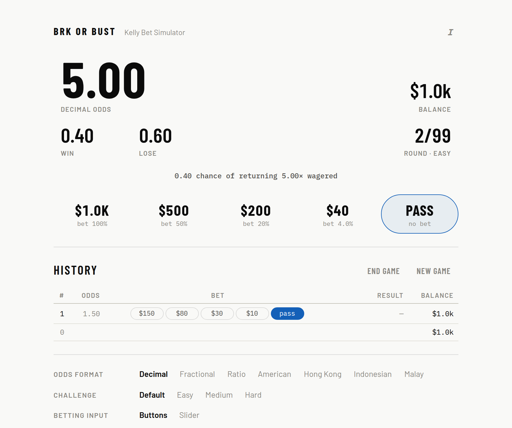

# Brk or Bust

_Kelly Bet Simulator_

A multi-round betting game for training your [Kelly criterion](https://en.wikipedia.org/wiki/Kelly_criterion) intuition. Static site, no build step, no dependencies.

**Play it: https://jaamesd.github.io/kelly-game/**



## How it works

- You start with **$1,000** (whole dollars, always). Each round shows odds and win/lose probabilities. Size your bet — or pass. Bust (below $1) and it's over; otherwise the game runs 99 rounds, extendable by 99 at a time, and you can end it whenever.
- Odds display in your choice of **decimal, fractional, ratio, American, Hong Kong, Indonesian, or Malay**. Decimal odds pair with decimal probabilities; the rest use percentages.
- Odds are log-normal around even money, so heavy favorites and long shots both show up. Most rounds carry a positive edge, about 1 in 10 is a negative-edge trap, and another 1 in 10 has an edge so small only a token bet is right.
- **Challenge** — _Easy_ is binary win/lose with positive edges. _Medium_ adds negative-edge traps. _Hard_ adds ternary rounds (win + lose < 100%, the rest pushes). _Default_ ramps Easy → Medium → Hard as the game progresses.
- **Betting input** — _Buttons_: four round amounts plus pass; sizes are drawn geometrically and kept a real ratio apart, one option always lands within 0.1–2× Kelly, the biggest is usually a deliberate overbet, and roughly one round in six offers no good bet at all — the discipline is passing. _Slider_: bet in basis points of bankroll, with big-endian percent typing (9 → 90%, 125 → 12.5%, ↵ bets).
- **Coaching** — on: the in-game ledger outlines the optimal play and scores each bet's k; off: you just see your picks. The end screen always reveals everything.

## Scoring

For a bet paying `b : 1` with win chance `p` and lose chance `q`, the growth-optimal fraction of bankroll is

```
f* = (p·b − q) / (b · (p + q))
```

Each round's **Kelly score** `k` is the fraction you bet divided by `f*` — near 1 is a perfect size, 0 is a pass, past 2 is where betting turns self-destructive, and negative means you put money on a negative edge.

## The end screen

- **Summary** — final balance, median k, then win and loss bands: totals, average k, and round counts for each.
- **Kelly scores** — a histogram of your k per round (buckets of 0.1 from −1 to 5, overflow at both ends), viewable as round counts by outcome, dollars, or growth.
- **Outcomes** — a live Monte Carlo replay of your game: the distribution of final balances if the same rounds were rerun with your bet sizes (or with exact Kelly bets), on a log dollar axis, with your actual result and the serial EV marked. It refines the longer you watch.
- **History** — the round-by-round ledger, exportable with **Copy CSV** (clipboard) or **Download CSV** — both paste straight into Google Sheets.

## Development

Everything is vanilla HTML/CSS/JS:

- `index.html` — page and styles
- `kelly.js` — pure game math (round generation, Kelly fraction, scoring); runs in Node too
- `app.js` — UI layer
- `test.js` — invariant tests: `node test.js`

`?autoplay=80` on the URL plays 80 random rounds and jumps to the results screen — handy for eyeballing the charts.

## License

[CC BY-SA 4.0](https://creativecommons.org/licenses/by-sa/4.0/) — see [LICENSE](LICENSE). The bundled fonts (Barlow, Barlow Condensed, IBM Plex Mono) are licensed separately under the [SIL Open Font License 1.1](fonts/OFL.txt).
